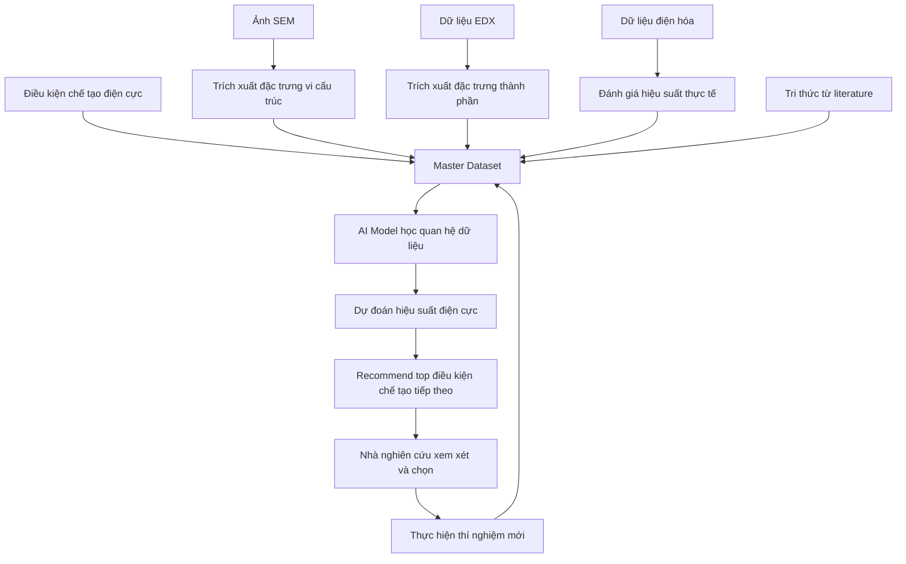

# Pipeline AI tối ưu hóa quy trình chế tạo điện cực nano-silicon/MXene cho pin lithium-ion

**Tên đề tài tiếng Việt đề xuất**  
Tối ưu hóa quy trình chế tạo điện cực âm từ hệ nano-silicon/few-layer Ti₃C₂Tₓ MXene sử dụng binder sodium alginate cho pin lithium-ion bằng trí tuệ nhân tạo đa phương thức

**English title**  
Multimodal AI-Assisted Optimization of Nano-Silicon/Few-Layer Ti₃C₂Tₓ MXene Anode Fabrication Using Sodium Alginate Binder for Lithium-Ion Batteries

---

## 1. Ý tưởng cốt lõi của pipeline

Pipeline AI của đề tài được xây dựng như một **trợ lý nghiên cứu hỗ trợ tối ưu thí nghiệm**. Thay vì chỉ dựa vào kinh nghiệm và thử-sai nhiều lần, hệ thống sẽ gom dữ liệu từ mỗi mẫu điện cực đã chế tạo, học mối liên hệ giữa **điều kiện chế tạo – đặc trưng vật liệu – hiệu suất điện hóa**, sau đó gợi ý các điều kiện chế tạo tiềm năng cho vòng thí nghiệm tiếp theo.

Nói đơn giản:

> Mỗi mẫu điện cực là một “recipe”. AI học từ các recipe cũ và đề xuất recipe tiếp theo có khả năng cho hiệu suất tốt hơn.

Pipeline không thay thế nhà nghiên cứu. AI chỉ đưa ra gợi ý, còn người nghiên cứu vẫn là người đánh giá, chỉnh sửa và quyết định điều kiện thí nghiệm cuối cùng.

---

## 2. Vấn đề nghiên cứu cần giải quyết

Trong phát triển điện cực silicon cho pin lithium-ion, nano-silicon có dung lượng lý thuyết cao nhưng thường gặp vấn đề lớn về **giãn nở thể tích trong quá trình sạc/xả**, dẫn đến nứt vỡ cấu trúc, mất tiếp xúc dẫn điện và suy giảm dung lượng nhanh. Việc kết hợp nano-silicon với few-layer Ti₃C₂Tₓ MXene và sodium alginate binder nhằm cải thiện mạng dẫn điện, tăng độ bền cơ học và nâng cao độ ổn định chu kỳ.

Tuy nhiên, để tìm được tỷ lệ thành phần và điều kiện chế tạo phù hợp, nhóm nghiên cứu thường phải thử nhiều mẫu khác nhau. Mỗi mẫu lại tạo ra nhiều loại dữ liệu như ảnh SEM, dữ liệu EDX và kết quả đo điện hóa. Nếu chỉ phân tích thủ công, quá trình tối ưu sẽ chậm và dễ bỏ sót mối liên hệ giữa các yếu tố.

Vì vậy, đề tài đề xuất một pipeline AI đa dữ liệu để hỗ trợ:

- Tổ chức dữ liệu thí nghiệm một cách có hệ thống.
- Học mối quan hệ giữa công thức chế tạo, vi cấu trúc, thành phần và hiệu suất.
- Gợi ý điều kiện chế tạo tiếp theo nhằm giảm thử-sai.

---

## 3. Sơ đồ pipeline tổng quát



---

## 4. Pipeline theo từng block

### Block 1 — Thu thập dữ liệu đầu vào

**Mục tiêu:** gom tất cả dữ liệu liên quan đến từng mẫu điện cực.

Dữ liệu đầu vào gồm:

1. **Điều kiện chế tạo**
   - Hàm lượng nano-silicon.
   - Hàm lượng few-layer Ti₃C₂Tₓ MXene.
   - Hàm lượng sodium alginate binder.
   - Hàm lượng carbon dẫn điện nếu có.
   - Thời gian trộn.
   - Nhiệt độ sấy.
   - Áp lực ép điện cực nếu có.

2. **Ảnh SEM**
   - Quan sát hình thái bề mặt.
   - Đánh giá mức độ kết tụ, độ xốp, nứt vỡ, sự đồng đều của vật liệu.

3. **Dữ liệu EDX**
   - Thành phần nguyên tố.
   - Tỷ lệ Si, Ti, C, O.
   - Mức độ tạp chất.
   - Sự phân bố nguyên tố nếu có bản đồ EDX.

4. **Dữ liệu điện hóa**
   - Dung lượng ban đầu.
   - Dung lượng sau 50/100 chu kỳ.
   - Khả năng duy trì dung lượng.
   - Hiệu suất Coulomb.
   - Trở kháng nếu có dữ liệu EIS.

5. **Tri thức literature**
   - Các tỷ lệ vật liệu đã được báo cáo.
   - Điều kiện chế tạo thường dùng.
   - Xu hướng ảnh hưởng của MXene, binder và vi cấu trúc đến hiệu suất.

**Output của block:** dữ liệu thô theo từng mẫu, được gắn bằng `sample_id`.

---

### Block 2 — Chuẩn hóa dữ liệu và tạo master dataset

**Mục tiêu:** biến dữ liệu rời rạc thành một bảng dữ liệu thống nhất.

Mỗi hàng trong master dataset tương ứng với một mẫu điện cực.

Ví dụ:

| sample_id | Si content | MXene content | Alginate content | Porosity | Crack density | Si/Ti ratio | Retention 100 |
|---|---:|---:|---:|---:|---:|---:|---:|
| S001 | 60 | 20 | 10 | 0.42 | 0.08 | 2.3 | 70.8 |
| S002 | 65 | 15 | 10 | 0.48 | 0.05 | 3.0 | 80.0 |
| S003 | 70 | 10 | 10 | 0.35 | 0.12 | 4.0 | 58.5 |

Trong pipeline AI, đây là phần quan trọng nhất vì model chỉ học tốt nếu dữ liệu được tổ chức rõ ràng.

**Output của block:** `master_dataset.csv`.

---

### Block 3 — Trích xuất đặc trưng từ ảnh SEM

**Mục tiêu:** chuyển ảnh SEM thành các đặc trưng số để AI có thể học.

AI không trực tiếp “hiểu” ảnh SEM theo cách con người nhìn. Vì vậy, ảnh cần được chuyển thành các feature định lượng.

Các feature có thể lấy từ SEM:

- Kích thước hạt trung bình.
- Mức độ kết tụ.
- Độ xốp tương đối.
- Mật độ vết nứt.
- Độ đồng đều bề mặt.
- Mức độ suy thoái bề mặt sau chu kỳ sạc/xả.

Ví dụ output:

| sample_id | particle_size_mean | porosity_score | agglomeration_index | crack_density | surface_uniformity |
|---|---:|---:|---:|---:|---:|
| S001 | 120 | 0.42 | 0.31 | 0.08 | 0.75 |

**Cách triển khai MVP:** dùng ImageJ, OpenCV hoặc scikit-image để lấy feature đơn giản. Sau này có thể dùng SAM/SAM2 hoặc mô hình segmentation chuyên sâu hơn.

---

### Block 4 — Trích xuất đặc trưng từ EDX

**Mục tiêu:** đưa thông tin thành phần nguyên tố vào model.

EDX giúp kiểm tra vật liệu có đúng thành phần mong muốn hay không và các nguyên tố phân bố có đồng đều không.

Feature có thể lấy từ EDX:

- `si_percent`
- `ti_percent`
- `c_percent`
- `o_percent`
- `impurity_percent`
- `si_ti_ratio`
- `c_o_ratio`
- `elemental_uniformity_score` nếu có bản đồ EDX

Ví dụ:

| sample_id | Si % | Ti % | C % | O % | Si/Ti ratio |
|---|---:|---:|---:|---:|---:|
| S001 | 42 | 18 | 30 | 9 | 2.33 |

**Vai trò trong pipeline:** EDX là nguồn dữ liệu giúp AI hiểu “mẫu gồm những thành phần gì”, bổ sung cho SEM là “mẫu trông như thế nào”.

---

### Block 5 — Dữ liệu điện hóa làm target hiệu suất

**Mục tiêu:** cho AI biết mẫu nào tốt, mẫu nào kém.

Dữ liệu điện hóa là phản hồi thực tế của cell pin. Đây là phần dùng để đánh giá hiệu suất cuối cùng.

Các chỉ số quan trọng:

- `initial_capacity`: dung lượng ban đầu.
- `capacity_50`: dung lượng sau 50 chu kỳ.
- `capacity_100`: dung lượng sau 100 chu kỳ.
- `retention_100`: khả năng duy trì dung lượng sau 100 chu kỳ.
- `coulombic_efficiency`: hiệu suất Coulomb.
- `rct`: trở kháng chuyển điện tích nếu có EIS.

Target chính cho MVP:

> `retention_100` hoặc `cycling_stability`

Nói đơn giản:

> Điện hóa là “điểm số thật” để AI biết recipe nào đang tốt.

---

### Block 6 — AI model học quan hệ giữa dữ liệu và hiệu suất

**Mục tiêu:** model học mối liên hệ giữa điều kiện chế tạo, đặc trưng vật liệu và hiệu suất pin.

Input của model:

- Tỷ lệ nano-silicon.
- Tỷ lệ MXene.
- Tỷ lệ sodium alginate.
- Điều kiện chế tạo.
- Feature SEM.
- Feature EDX.

Output của model:

- Dự đoán độ bền chu kỳ.
- Dự đoán capacity retention.
- Ước lượng mẫu nào có rủi ro suy giảm nhanh.

Model MVP nên dùng:

- Random Forest Regressor.
- XGBoost nếu setup được nhanh.

Model mở rộng sau proposal:

- Gaussian Process Regression.
- Bayesian Optimization.
- Model có uncertainty để hỗ trợ quyết định tốt hơn.

---

### Block 7 — AI recommend điều kiện chế tạo tiếp theo

**Mục tiêu:** đây là đầu ra quan trọng nhất của pipeline.

Sau khi model học từ các mẫu cũ, hệ thống sẽ tạo nhiều candidate recipe mới trong phạm vi cho phép, dự đoán hiệu suất của từng recipe, sau đó chọn ra top điều kiện chế tạo tiềm năng nhất.

AI có thể recommend:

- Tỷ lệ nano-silicon.
- Tỷ lệ few-layer Ti₃C₂Tₓ MXene.
- Hàm lượng sodium alginate binder.
- Hàm lượng carbon dẫn điện nếu có.
- Thời gian trộn.
- Nhiệt độ sấy.
- Áp lực ép điện cực nếu có.

Ví dụ output:

| Rank | Si content | MXene content | Alginate | Drying temp | Predicted retention | Confidence | Reason |
|---:|---:|---:|---:|---:|---:|---|---|
| 1 | 65 | 20 | 10 | 80 | 82.5% | Medium | Balanced Si/MXene ratio and stable predicted cycling |
| 2 | 60 | 25 | 10 | 80 | 80.8% | Medium | Higher MXene may improve conductive network |
| 3 | 70 | 15 | 10 | 90 | 78.9% | Low | High Si may increase capacity but has higher degradation risk |

Câu giải thích cho slide:

> AI không chỉ dự đoán mẫu hiện tại tốt hay kém, mà còn đề xuất các điều kiện chế tạo nên thử ở vòng thí nghiệm tiếp theo.

---

### Block 8 — Human-in-the-loop

**Mục tiêu:** giữ vai trò quyết định của nhà nghiên cứu.

AI không tự động ra lệnh cho phòng thí nghiệm. Hệ thống chỉ hiển thị:

- Điều kiện chế tạo được gợi ý.
- Hiệu suất dự đoán.
- Mức độ tin cậy/rủi ro.
- Lý do đề xuất.

Nhà nghiên cứu có thể:

- Chấp nhận đề xuất.
- Chỉnh sửa điều kiện.
- Từ chối nếu không phù hợp với điều kiện lab.

Cách này giúp pipeline thực tế hơn, vì trong nghiên cứu vật liệu luôn có các ràng buộc thực nghiệm mà AI có thể chưa biết hết.

---

### Block 9 — Feedback loop

**Mục tiêu:** kết quả thí nghiệm mới quay lại giúp model tốt hơn.

Sau khi nhóm chế tạo mẫu mới theo điều kiện được chọn, mẫu sẽ tiếp tục được đo SEM, EDX và điện hóa. Dữ liệu mới được thêm vào master dataset, model được cập nhật và hệ thống tiếp tục đề xuất vòng thí nghiệm mới.

Flow:

```text
AI đề xuất điều kiện chế tạo
↓
Nhà nghiên cứu chọn và làm thí nghiệm
↓
Đo SEM, EDX, điện hóa
↓
Cập nhật master dataset
↓
Train/update model
↓
AI đề xuất vòng tiếp theo
```

Đây là điểm biến pipeline thành một hệ tối ưu hóa khép kín.

---

## 5. Cách trình bày pipeline trong slide

### Slide 1 — Problem

**Thông điệp chính:** tối ưu vật liệu điện cực silicon cần nhiều thử-sai.

Nội dung gợi ý:

- Nano-silicon có dung lượng cao nhưng dễ suy giảm do giãn nở thể tích.
- MXene và sodium alginate được dùng để cải thiện mạng dẫn điện và độ bền cơ học.
- Tuy nhiên, tìm tỷ lệ và điều kiện chế tạo phù hợp vẫn tốn nhiều thí nghiệm.

---

### Slide 2 — Proposed idea

**Thông điệp chính:** dùng AI như trợ lý nghiên cứu để giảm thử-sai.

Nội dung gợi ý:

- AI học từ dữ liệu chế tạo, SEM, EDX và điện hóa.
- AI tìm mối liên hệ giữa recipe và hiệu suất.
- AI đề xuất điều kiện chế tạo tiếp theo cho nhà nghiên cứu.

---

### Slide 3 — Data sources

**Thông điệp chính:** hệ thống dùng nhiều nguồn dữ liệu.

Bảng gợi ý:

| Dữ liệu | Vai trò |
|---|---|
| Điều kiện chế tạo | Cho biết mẫu được làm như thế nào |
| SEM | Cho biết hình thái và vi cấu trúc |
| EDX | Cho biết thành phần nguyên tố |
| Điện hóa | Cho biết hiệu suất thật của cell |
| Literature | Cung cấp tri thức nền và khoảng giá trị ban đầu |

---

### Slide 4 — AI pipeline

**Thông điệp chính:** dữ liệu → model → recommendation → thí nghiệm mới.

Có thể dùng flow ngắn:

```text
Process data + SEM + EDX + Electrochemistry
↓
Master Dataset
↓
AI Model
↓
Predicted Performance
↓
Top 3 Recommended Fabrication Conditions
↓
Human Review
↓
Next Experiment
```

---

### Slide 5 — Recommendation example

**Thông điệp chính:** output của AI là recipe thí nghiệm tiếp theo.

Ví dụ:

| Rank | Si | MXene | Alginate | Temp | Predicted retention |
|---:|---:|---:|---:|---:|---:|
| 1 | 65% | 20% | 10% | 80°C | 82.5% |
| 2 | 60% | 25% | 10% | 80°C | 80.8% |
| 3 | 70% | 15% | 10% | 90°C | 78.9% |

Câu nói khi thuyết trình:

> Đây là ví dụ đầu ra của hệ thống. AI không thay thế người nghiên cứu mà gợi ý một số điều kiện đáng thử, kèm hiệu suất dự đoán và lý do đề xuất.

---

### Slide 6 — Novelty and positioning

**Thông điệp chính:** điểm mới là tích hợp nhiều nguồn dữ liệu để hỗ trợ tối ưu vật liệu trong điều kiện dữ liệu ít.

Nên nói:

- Không claim tạo ra AI hoàn toàn mới.
- Không claim là hệ tối ưu tổng quát cho toàn ngành pin.
- Điểm mạnh là workflow thực tế cho lab nhỏ: SEM + EDX + điện hóa + literature → recommendation.

Câu chốt:

> Điểm mới của đề tài nằm ở việc tích hợp dữ liệu hình thái, thành phần, hiệu suất điện hóa và tri thức nền để hỗ trợ lựa chọn điều kiện chế tạo điện cực silicon–MXene trong điều kiện dữ liệu thực nghiệm hạn chế.

---

### Slide 7 — MVP demo plan

**Thông điệp chính:** có thể triển khai prototype bằng code.

MVP gồm:

- Synthetic/sample dataset.
- Master dataset builder.
- Baseline model dự đoán retention.
- Recommendation engine top 3 recipe.
- Streamlit dashboard.

Output demo:

- Bảng master dataset.
- Feature importance.
- Top 3 AI recommendations.

---

## 6. Cách nói ngắn gọn trong buổi trình bày

> Pipeline AI của nhóm hoạt động như một trợ lý nghiên cứu. Mỗi mẫu điện cực sau khi chế tạo sẽ tạo ra dữ liệu về điều kiện chế tạo, ảnh SEM, thành phần EDX và kết quả điện hóa. Các dữ liệu này được gom thành một master dataset để model học mối liên hệ giữa cách chế tạo, đặc điểm vật liệu và hiệu suất pin. Sau đó, hệ thống đề xuất một số điều kiện chế tạo tiềm năng cho vòng thí nghiệm tiếp theo. Nhà nghiên cứu sẽ xem xét đề xuất, chọn điều kiện phù hợp, thực hiện thí nghiệm mới và đưa kết quả ngược lại để model tiếp tục học. Nhờ đó, quy trình tối ưu vật liệu có thể giảm thử-sai và tiết kiệm thời gian thực nghiệm.

---

## 7. Điểm cần nhấn mạnh để tránh bị hỏi khó

### Không nên nói

- “AI sẽ tự tìm ra vật liệu mới.”
- “Đây là pipeline đầu tiên trên thế giới.”
- “Hệ thống có thể tối ưu toàn bộ ngành sản xuất pin.”
- “Model sẽ chính xác cao ngay từ đầu.”

### Nên nói

- “AI là công cụ hỗ trợ ra quyết định.”
- “Pipeline hướng đến điều kiện dữ liệu ít trong lab.”
- “Kết quả AI là gợi ý, không thay thế nhà nghiên cứu.”
- “MVP trước mắt là chứng minh logic dữ liệu → model → recommendation.”
- “Khi có dữ liệu thực nghiệm nhiều hơn, mô hình sẽ được cập nhật và cải thiện.”

---

## 8. Paper map để đặt vào slide literature/support

### 8.1. Closed-loop optimization và AI recommend thí nghiệm

1. **Choi et al. — Image-Guided Microstructure Optimization using Diffusion Models: Validated with Li-Mn-rich Cathode Precursors**  
   Link: https://arxiv.org/abs/2505.07906  
   Vai trò: công trình rất gần về image-guided microstructure optimization. Paper dùng SEM morphology, diffusion model và PSO để tìm điều kiện tổng hợp cho morphology mục tiêu.

2. **CAMEO — On-the-fly closed-loop materials discovery via Bayesian active learning**  
   Link: https://www.nature.com/articles/s41467-020-19597-w  
   Vai trò: chứng minh closed-loop active learning có thể dùng để chọn thí nghiệm tiếp theo trong nghiên cứu vật liệu.

3. **Duquesnoy/Franco — Machine learning-assisted optimization of electrode manufacturing**  
   Link 1: https://arxiv.org/abs/2205.01621  
   Link 2: https://arxiv.org/abs/2307.05521  
   Vai trò: chứng minh ML có thể hỗ trợ inverse design và tối ưu thông số sản xuất điện cực lithium-ion.

---

### 8.2. LLM và literature mining

1. **Dagdelen et al. — Structured information extraction from scientific text with large language models**  
   Link: https://www.nature.com/articles/s41467-024-45563-x  
   Vai trò: chứng minh LLM có thể trích xuất thông tin có cấu trúc từ văn bản khoa học.

---

### 8.3. SEM/EDX và phân tích vật liệu pin

1. **Kato et al. — quantitative SEM–EDS analytical process for lithium-ion battery electrodes**  
   Vai trò: hỗ trợ ý tưởng dùng SEM–EDS để định lượng đặc trưng vật liệu điện cực và phân tích suy thoái.

2. **SEM image analysis / microstructure segmentation papers**  
   Vai trò: hỗ trợ block chuyển ảnh SEM thành feature số như particle size, porosity, crack density.

---

### 8.4. Vật liệu silicon–MXene và sodium alginate binder

Cần research thêm các nhóm paper:

1. Silicon anode volume expansion and cycling stability.
2. Ti₃C₂Tₓ MXene as conductive framework for silicon-based anodes.
3. Sodium alginate as water-based binder for silicon anodes.
4. Silicon–MXene composite anodes for lithium-ion batteries.

Vai trò: chứng minh lựa chọn vật liệu có cơ sở khoa học, còn AI là lớp hỗ trợ tối ưu hóa quy trình.

---

## 9. One-slide summary

**Pipeline AI tối ưu của đề tài:**

- Mỗi mẫu điện cực được xem như một recipe thí nghiệm.
- Dữ liệu gồm điều kiện chế tạo, SEM, EDX và điện hóa.
- Tất cả được chuẩn hóa thành master dataset theo `sample_id`.
- AI học quan hệ giữa recipe, vi cấu trúc, thành phần và hiệu suất.
- Model dự đoán độ bền chu kỳ/capacity retention.
- Hệ thống recommend top điều kiện chế tạo tiếp theo.
- Nhà nghiên cứu chọn hoặc chỉnh sửa đề xuất.
- Kết quả thí nghiệm mới quay lại cập nhật model.

**Câu chốt:**

> AI Co-scientist của nhóm là một hệ hỗ trợ ra quyết định trong phòng thí nghiệm, giúp giảm thử-sai bằng cách học từ dữ liệu chế tạo, SEM, EDX và điện hóa để gợi ý điều kiện chế tạo điện cực silicon–MXene tiềm năng cho vòng thí nghiệm tiếp theo.

---

## 10. Checklist đưa vào slide

- [ ] Có vấn đề nghiên cứu: silicon anode dễ suy giảm do giãn nở thể tích.
- [ ] Có giải pháp vật liệu: nano-silicon + few-layer Ti₃C₂Tₓ MXene + sodium alginate.
- [ ] Có lý do cần AI: giảm thử-sai và tận dụng dữ liệu thí nghiệm.
- [ ] Có sơ đồ pipeline.
- [ ] Có giải thích input/output từng block.
- [ ] Có ví dụ output recommendation.
- [ ] Có human-in-the-loop.
- [ ] Có feedback loop.
- [ ] Có paper support.
- [ ] Không claim quá đà.
